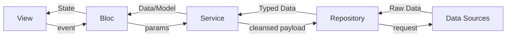
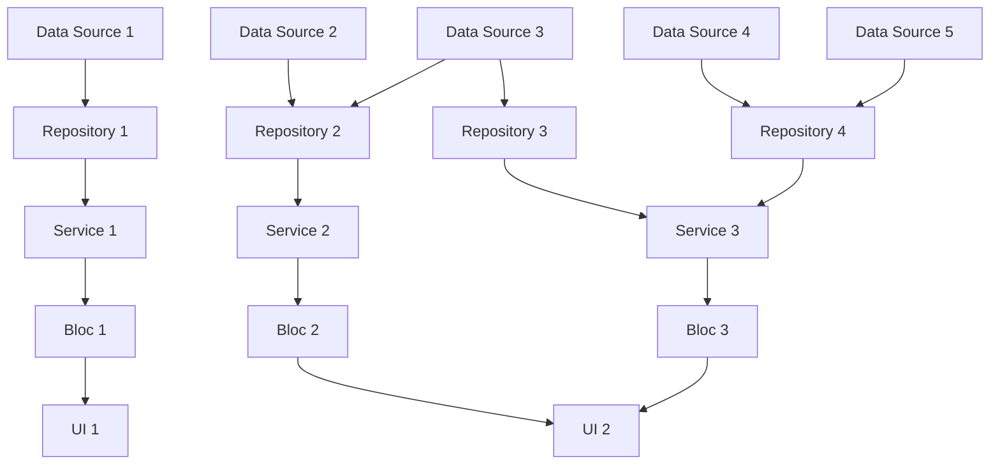
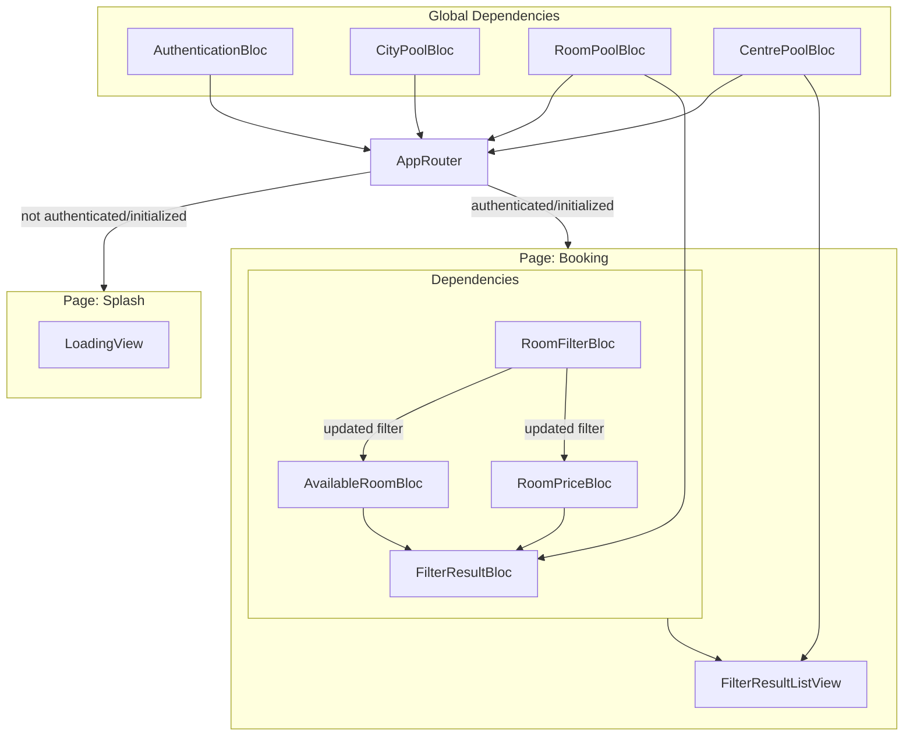

# My Tec

![coverage][coverage_badge]
[![style: very good analysis][very_good_analysis_badge]][very_good_analysis_link]
[![License: MIT][license_badge]][license_link]

Generated by the [Very Good CLI][very_good_cli_link] 🤖

MyTEC Code Test - Meeting Room Listing Module

## Table of Contents

- [My Tec](#my-tec)
  - [Table of Contents](#table-of-contents)
  - [0. Markdown Preview Setup](#0-markdown-preview-setup)
    - [Option 1: Markdown Preview Enhanced](#option-1-markdown-preview-enhanced)
    - [Option 2: Markdown Preview Mermaid Support](#option-2-markdown-preview-mermaid-support)
  - [1. Getting Started 🚀](#1-getting-started-)
    - [1.1 Flutter \& Dart Version](#11-flutter--dart-version)
    - [1.2 Install Dependencies](#12-install-dependencies)
    - [1.3 Code Generation](#13-code-generation)
    - [1.4 Environment Variables](#14-environment-variables)
    - [1.5 Running the App](#15-running-the-app)
    - [1.6 Building the App](#16-building-the-app)
  - [2. Working with Translations 🌐](#2-working-with-translations-)
    - [2.1 Adding Strings](#21-adding-strings)
    - [2.2 Adding Supported Locales](#22-adding-supported-locales)
    - [2.3 Adding Translations](#23-adding-translations)
    - [2.4 Generating Translations](#24-generating-translations)
  - [3. Project Architecture Overview 🏗️](#3-project-architecture-overview-️)
    - [3.1 High Level Overview](#31-high-level-overview)
    - [3.2 A Slightly More Detailed Overview](#32-a-slightly-more-detailed-overview)
    - [3.3 File/Folders Breakdown](#33-filefolders-breakdown)
    - [3.4 Centralized API Client Logics](#34-centralized-api-client-logics)
    - [3.5 Error Handling](#35-error-handling)
  - [4. General Dependency Tree 🔃](#4-general-dependency-tree-)

## 0. Markdown Preview Setup

### Option 1: Markdown Preview Enhanced

1. Install the [Markdown Preview Enhanced](https://marketplace.visualstudio.com/items?itemName=shd101wyy.markdown-preview-enhanced) extension in your VSCode.
2. Open the command palette and search for "Markdown Preview Enhanced: Open Preview to the Side".
3. Open this file (`README.md`) in your editor.

### Option 2: Markdown Preview Mermaid Support

1. Install the [Markdown Preview Mermaid Support](https://marketplace.visualstudio.com/items?itemName=bierner.markdown-mermaid) extension in your VSCode.
2. Open the command palette and search for "Markdown: Open Preview to the Side".
3. Open this file (`README.md`) in your editor.

## 1. Getting Started 🚀

### 1.1 Flutter & Dart Version

This project uses the latest Flutter (`3.32.4`) and Dart (`3.8.1`).

- To upgrade your Flutter SDK, run:

  ```sh
  flutter upgrade
  ```

- Alternatively, you can use [FVM](https://fvm.app/) to manage and switch between different Flutter versions:

  ```sh
  fvm use 3.32.4
  ```

### 1.2 Install Dependencies

```sh
flutter pub get
```

### 1.3 Code Generation

This project relies heavily on generated code to reduce boilerplate.

- To generate l10n related code, run:

  ```sh
  flutter gen-l10n --arb-dir="lib/l10n/arb"
  ```

- To generate remaining necessary code **once**, run:

  ```sh
  dart run build_runner build -d
  ```

- For **continuous** code generation on file changes, use:

  ```sh
  dart run build_runner watch -d
  ```

### 1.4 Environment Variables

To make valid API calls, create a `.env` file in the project root with the following keys:

```sh
TEC_API_BASE_URL=your_api_base_url
X_ACCESS_KEY=your_access_key
```

Replace the values with your actual API base URL and access key.

### 1.5 Running the App

This project contains 3 flavors:

- development
- staging
- production

To run the desired flavor either use the launch configuration in VSCode/Android Studio or use the following commands:

```sh
# Development
$ flutter run --flavor development --target lib/main_development.dart

# Staging
$ flutter run --flavor staging --target lib/main_staging.dart

# Production
$ flutter run --flavor production --target lib/main_production.dart
```

### 1.6 Building the App

To build the app for different flavors, use the following commands:

```sh
# Development
$ flutter build apk --flavor development --target lib/main_development.dart

# Staging
$ flutter build apk --flavor staging --target lib/main_staging.dart

# Production
$ flutter build apk --flavor production --target lib/main_production.dart
```

> For now, I don't have access to a Mac, so I cannot provide accurate instructions for building the iOS app.

---

## 2. Working with Translations 🌐

This project relies on [flutter_localizations][flutter_localizations_link] and follows the [official internationalization guide for Flutter][internationalization_link].

### 2.1 Adding Strings

1. To add a new localizable string, open the `app_en.arb` file at `lib/l10n/arb/app_en.arb`.

    ```arb
    {
        "@@locale": "en",
        "counterAppBarTitle": "Counter",
        "@counterAppBarTitle": {****
            "description": "Text shown in the AppBar of the Counter Page"
        }
    }
    ```

2. Then add a new key/value and description

    ```arb
    {
        "@@locale": "en",
        "counterAppBarTitle": "Counter",
        "@counterAppBarTitle": {
            "description": "Text shown in the AppBar of the Counter Page"
        },
        "helloWorld": "Hello World",
        "@helloWorld": {
            "description": "Hello World Text"
        }
    }
    ```

3. Use the new string

    ```dart
    import 'package:my_tec/l10n/l10n.dart';

    @override
    Widget build(BuildContext context) {
    final l10n = context.l10n;
    return Text(l10n.helloWorld);
    }
    ```

### 2.2 Adding Supported Locales

Update the `CFBundleLocalizations` array in the `Info.plist` at `ios/Runner/Info.plist` to include the new locale.

```xml
    ...

    <key>CFBundleLocalizations</key>
 <array>
  <string>en</string>
  <string>es</string>
 </array>

    ...
```

### 2.3 Adding Translations

1. For each supported locale, add a new ARB file in `lib/l10n/arb`.

    ```folder
    ├── l10n
    │   ├── arb
    │   │   ├── app_en.arb
    │   │   └── app_es.arb // e.g. Spanish translations
    ```

2. Add the translated strings to each `.arb` file:

    `app_en.arb`

    ```json
    {
        "@@locale": "en",
        "appBarTitle": "Sample title",
        "@appBarTitle": {
            "description": "Sample description"
        }
    }
    ```

    `app_es.arb`

    ```json
    {
        "@@locale": "es",
        "appBarTitle": "Título de ejemplo",
        "@appBarTitle": {
            "description": "Descripción de ejemplo"
        }
    }
    ```

### 2.4 Generating Translations

To use the latest translations changes, you will need to generate them:

1. Generate localizations for the current project:

    ```sh
    flutter gen-l10n --arb-dir="lib/l10n/arb"
    ```

Alternatively, run `flutter run` and code generation will take place automatically.

## 3. Project Architecture Overview 🏗️

### 3.1 High Level Overview

This project follows a layered architecture that separates concerns into distinct layers, making it easier to manage and scale the application. The layers are:



1. **Data Sources**: The raw data sources, typically remote APIs or on-device database.
2. **Repository**: This layer abstracts the data sources, handles the data serialization and provides a clean API for the service layer.
3. **Service**: This layer contains the business logic and decides how to fetch and manipulate data. It interacts with the repository to get the data it needs.
4. **Bloc**: This layer manages the state of the application and interacts with the service layer.
5. **View**: This is the presentation layer that displays the data and interacts with the user.
6. **Data**: This represent the data classes fetched from the data sources.
7. **Model**: This represent a cleansed version of the data classes.

> To better understand the difference between **Data** and **Model**, may take [room.dart](lib/modules/meeting_rooms/models/room.dart) as an example, where `Room` is the model which is composed of multiple data classes such as `RoomInfo`, `RoomAvailability`, `RoomPrice` etc.\
> These three  data classes represent the raw data fetched from the API, while `Room` is a higher-level abstraction that combines these data classes into a single entity that can be easily used by the widget.\
> The `Room` model groups these data classes into a single entity that can be easily used in the application.

### 3.2 A Slightly More Detailed Overview



This illustrates a layered architecture where multiple data sources feed into repositories, which in turn provide data to various services.

Each **repository** aggregates and manages data from one or more data sources, ensuring data consistency and abstraction.

**Services** consume data from these repositories and encapsulate business logic, preparing the data for the application's state management layer, represented by Blocs.

Each **Bloc** manages the state for a specific feature or UI component, receiving processed data from the services.

Finally, the **UI** components subscribe to the relevant Blocs to display up-to-date information and respond to user interactions.

This structure promotes separation of concerns, scalability, and maintainability across the application.

### 3.3 File/Folders Breakdown

1. `configs/routes` folder:
   - Defines the route tree and required parameters for each route.
   - Contains the middleware for route guards and redirection base on different Blocs' state.
   - Defines the commonly shared UI layouts and dependencies for specific sub-routes.

2. `modules` folder:
   - Contains the features of the application, each represented by a sub-folder.
   - Each module contains its own data sources, repositories, services, blocs, models, and views.
   - Modules are self-contained and can be developed independently.

3. `pages` folder:
   - The actual UI pages of the application.
   - Defines the UI components and corresponding dependencies for each page.

4. `widgets` folder:
   - Contains reusable & generic widgets that can be used across different modules and pages.

5. `utils` folder:
   - Contains utility classes and functions that are used across the application.
   - Includes extensions, constants, mixins, type-conversion functions...

### 3.4 Centralized API Client Logics

The project uses a centralized API client, implemented as the [TecApiClient](lib/utils/mixins/api_clients/tec/tec_api_client.dart) mixin, to standardize and simplify all HTTP interactions with the TEC backend. This client is designed for extensibility, maintainability, and type safety.

- **Environment-based Configuration:**  
  The base URL and access key are loaded from environment variables (`.env`), ensuring secure and flexible configuration for different environments (development, staging, production).

- **Unified Request Handling:**  
  All API calls are made through the `requestTEC` method, which takes a strongly-typed `TecApiRequest` object. This encapsulates the HTTP method, endpoint, query parameters, body, and file uploads.

- **Typed Endpoints and Requests:**  
  Endpoints are defined in the `TecApiEndpoints` enum, and request/query parameter types are modeled using `freezed` classes (e.g., `RoomAvailabilityQuery`, `RoomPriceQuery`). This ensures compile-time safety, clear API usage and reduces effort in JSON de/serialization.

- **Automatic Header and Auth Management:**  
  The client automatically attaches the required access key to requests, and throws a custom exception if authentication is missing for protected endpoints.

**Usage Example:**

```dart
final response = await requestTEC(
  request: TecApiRequest.getRoomAvailability(
    query: RoomAvailabilityQuery(
      startDate: ...,
      endDate: ...,
      cityCode: ...,
    ),
  ),
);
```

### 3.5 Error Handling

The project uses a robust, centralized error handling system built around the [CustomExceptionHandler](lib/utils/mixins/exceptions/custom_exception_handler.dart) mixin and a hierarchy of custom exception classes. This approach ensures that all errors are handled consistently and transparently across the codebase.

**Key Features:**

- **Custom Exception Types:**  
  All errors are represented by subclasses of `CustomException`, such as `AppException`, `TecException`, and `UnknownException`. Each exception type is associated with a specific error code and message for clarity and debugging.

- **Typed Result Wrapper:**  
  The `Result` class (with `Success` and `Failure` variants) is used to wrap the outcome of operations, making it easy to distinguish between successful results and handled exceptions. With Dart's pattern matching, you can easily handle different result types with `switch` statements.

- **Safe Execution Helpers:**  
  The `tryRun` and `tryRunAsync` methods execute synchronous and asynchronous operations, respectively, catching any exceptions and converting them into a `Failure` result with a `CustomException`. This prevents unhandled exceptions from propagating and simplifies error handling in business logic.

- **Automatic Logging:**  
  All exceptions are logged using the centralized logger, providing useful context for debugging and monitoring.

- **Exception Conversion:**  
  The `exceptionFromObject` helper converts any unknown error object into a `CustomException`, ensuring that all error cases are handled uniformly.

**Usage Example:**

```dart
final result = tryRun(() {
  // Some operation that might throw
});

switch (result) {
    case Success(value):
        break;
    case Failure(exception):
        break;
}
```

**Benefits:**

- Promotes consistent error handling patterns across the app.
- Makes it easy to propagate, log, and display meaningful error messages.
- Reduces boilerplate and risk of unhandled exceptions.
- Facilitates robust error reporting and debugging.

## 4. General Dependency Tree 🔃



---

[coverage_badge]: coverage_badge.svg
[flutter_localizations_link]: https://api.flutter.dev/flutter/flutter_localizations/flutter_localizations-library.html
[internationalization_link]: https://flutter.dev/docs/development/accessibility-and-localization/internationalization
[license_badge]: https://img.shields.io/badge/license-MIT-blue.svg
[license_link]: https://opensource.org/licenses/MIT
[very_good_analysis_badge]: https://img.shields.io/badge/style-very_good_analysis-B22C89.svg
[very_good_analysis_link]: https://pub.dev/packages/very_good_analysis
[very_good_cli_link]: https://github.com/VeryGoodOpenSource/very_good_cli
